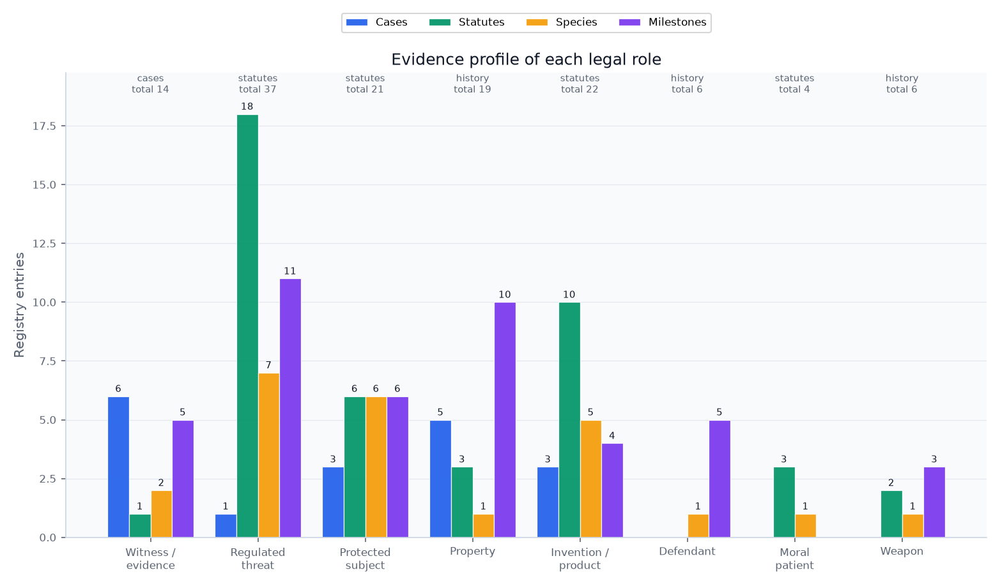
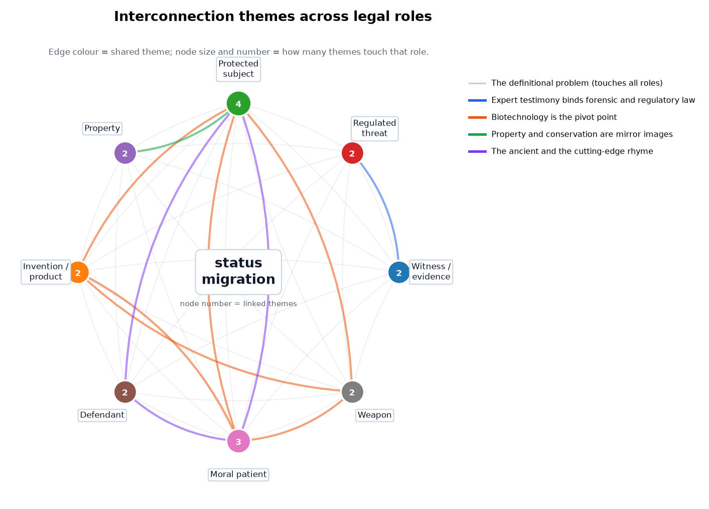
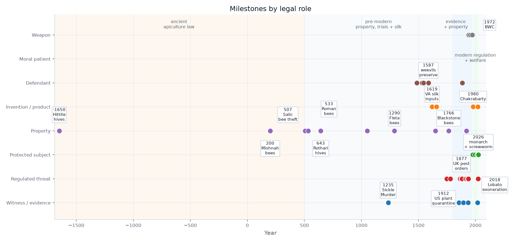
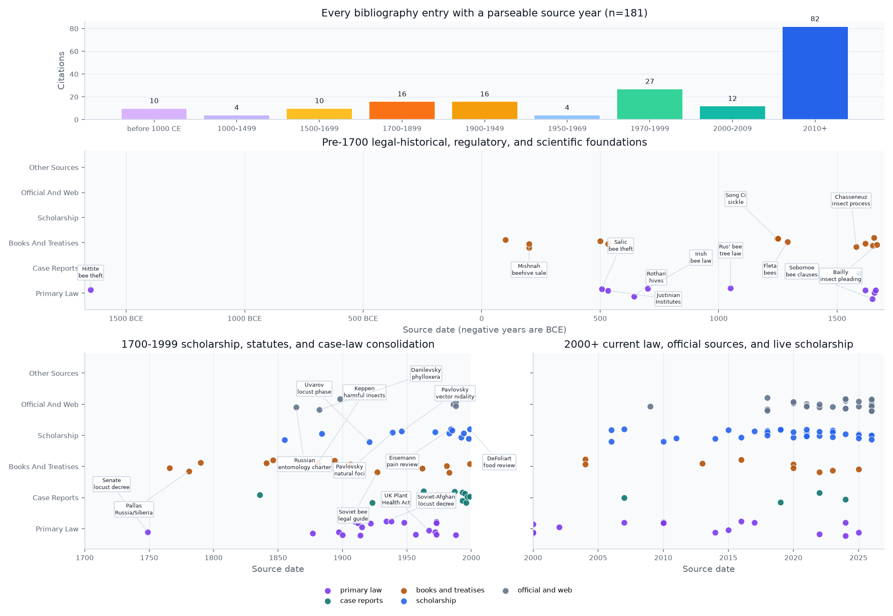

# Mapping Entomological Law: Roles, Evidence, and Limits {#sec:introduction}

"Entomological law" — or, from the other direction, "legal entomology" — is not a single discipline but a multi-domain complex in which insects and their biology touch legal norms at dozens of points. A bibliometric analysis of the research literature found that "forensic entomology" and "legal entomology" are used interchangeably and span well over a thousand articles across more than a hundred contributing countries [@magana2019bibliometric]. This reference treats the field in a broad sense: domains in which insects become objects or instruments of legal regulation.

Recent animal-law scholarship now names "insect law" directly, but this reference uses "entomological law" to keep the lens wider than animal-welfare doctrine: the same organism may enter evidence, quarantine, conservation, food, biotechnology, and weapons law before moral status is even at issue [@reddy2025insect_law].

The deeper connective problem is that courts and agencies repeatedly need insect biology to become what science-and-law scholarship calls a serviceable truth: reliable enough for action, bounded enough to expose uncertainty, and explicit enough to be revisited when the evidence changes [@jasanoff2015serviceable]. Forensic entomology translates larval development into time; quarantine law translates ecological risk into movement controls; conservation law translates population decline into listing decisions; welfare law translates sentience evidence into moral and statutory thresholds. The same epistemic move recurs across the field.

The second connective problem is classification. Classification systems are not neutral filing cabinets: they allocate visibility, responsibility, and institutional action [@bowker1999sorting]. Insects reveal that point with unusual force because they move across ordinary legal boundaries so easily. A fly can be an expert's clock, a statutory animal, a constitutional hook, or a nuisance depending on which classificatory gate opens first. The field therefore also depends on boundary-work: courts and agencies must decide when entomology is sufficiently scientific for evidence, sufficiently uncertain for precaution, sufficiently economic for trade restrictions, or sufficiently moral for welfare concern [@gieryn1983boundary_work; @jasanoff2004states_of_knowledge].

## The role model: what law needs insects to be

The field has no master statute and no single agency, yet it coheres. Its organizing principle is the **legal status the insect occupies in a given dispute**. The same organism is, in turn, a witness, a regulated threat, a protected subject, property, an invention, a defendant, a moral patient, or a weapon — and each role poses a question the legal system was not built to answer. The {{ROLE_COUNT}} roles, their domains, and their core questions are listed below and visualized with their registry evidence in the roles-overview figure.

{{ROLE_TABLE}}

{#fig:roles_overview width=95%}

## How the roles cohere: a preview

The {{ROLE_COUNT}} roles above are not silos; the registry also encodes {{INTERCONNECTION_COUNT}} recurring themes that cut across them, and that synthesis is worth seeing before the per-role sections rather than only after them. The network below previews the connective tissue @sec:interconnections unpacks in full: it is the map the rest of this reference keeps returning to, so it is placed here as an orientation figure rather than left to surface only at the end.

{#fig:role_interconnections width=85%}

## Why the registry comes first

A typical survey of this material mixes prose summaries of statutes with anecdotes of famous cases; both rot quickly as section numbers are recodified and holdings are distinguished. This reference inverts that pattern. Every legal role, case, statute, taxon, institution, and milestone cited in the prose comes from a Python registry under `src/`, and every count — "{{CASE_COUNT}} cases", "{{STATUTE_COUNT}} statutes", "{{SPECIES_COUNT}} taxa" — is a double-brace token resolved at build time by `src.manuscript_variables.generate_variables`. The discipline this enforces is the same reproducibility model the wider template uses: a count that drifts from its registry cannot reach a green PDF without the manuscript-token closure test flipping red first (@sec:methods).

## A legal history from bee swarms to gene drives

The field is old in more than one way. Its property lineage now reaches back before Rome: the Hittite Laws tariff stolen bees and bee hives, Mishnah Bava Batra treats bees as both beehive property and neighbor-law risk, and Roman law then turns swarms into the classic problem of wildness, sight, and pursuit [@hittite_laws_bees; @mishnah_bava_batra2_10_bees; @mishnah_bava_batra5_3_beehive; @justinian533; @justinian_digest41]. That lineage also passes through successor-kingdom and East Slavic tariff law: the Salic Law makes stolen bees a named theft subject, Rothari's Lombard code distinguishes an apiary vessel from bees taken out of a marked tree, and *Ruskaia Pravda* protects bort signs, bee trees, and removed bees as legally priced forest-apiculture injuries [@lex_salica_bees; @edictum_rothari_bees; @ruskaia_pravda_bees]. Muscovite law then makes the valuation still more granular: the 1649 *Sobornoe Ulozhenie* separately prices bee trees with and without bees, removed colonies, stolen hives, and deliberate destruction [@sobornoe_ulozhenie1649_bees]. Medieval English restatements such as *Fleta* then carry the occupation problem forward, while the evidentiary lineage begins with the 1235 Sickle Murder recounted by Song Ci in *The Washing Away of Wrongs* (1247), where flies settling on an apparently clean blade exposed invisible blood and forced a confession; the claim is bound here both to a Library of Congress record for the Chinese text and to McKnight's scholarly English translation [@fleta1290_bees; @songci1247; @songci_mcknight1981]. Its product-law lineage is old as well: early colonial instruments treated mulberries, silk inputs, silks, and wax as objects of public economic policy rather than merely private agricultural choices [@virginia_assembly1619_mulberry; @carolina_charter1663_silks_wax]. A Russian and Russian-Imperial threat-law lineage also begins before professional society infrastructure: a 1749 Senate decree made locust extermination a provincial administrative duty, Pallas's 1781 *Icones Insectorum* made insects of Russia and Siberia a taxonomic object, and later the chartered Russian Entomological Society, Keppen's harmful-insect compendium, and Danilevsky's phylloxera commission report show insect expertise entering administrative governance before modern plant-health law [@russian_senate1749_locust_belgorod; @pallas1781_icones_insectorum; @russian_entomological_society1864_charter; @keppen1881_harmful_insects; @danilevsky1882_phylloxera]. From there the registry traces {{MILESTONE_COUNT}} milestones across {{TIMELINE_SPAN_YEARS}} years — bee property, medieval animal trials, colonial silk policy, succession-based time-of-death estimation, eighteenth- and nineteenth-century pest administration, twentieth-century conservation and biotechnology statutes, and twenty-first-century sentience and gene-drive debates shown in the timeline figure.

{#fig:timeline width=98%}

The same arc appears twice in this reference, for two different reasons. The timeline above shows the milestones the law itself created; the figure below shows the sources that document them — every bibliography entry with a parseable date, not just the ones that became milestones. Reading the two side by side up front makes an honesty point before any doctrinal argument starts: the evidence base is not a thin modern layer with a few decorative antiquities, it has real pre-modern depth, and @sec:methods explains exactly how that bibliography is validated.

{#fig:citation_dates width=95%}

## Boundaries of the field map

This reference is a map, not a treatise. The registries are curated to anchor each role with its leading authorities, not to enumerate every decision, instrument, or species; the figures throughout describe the *encoded registries*, and their captions state that scope explicitly. Sections @sec:witness through @sec:weapon treat each role in turn; @sec:interconnections revisits the synthesis figure above in full, theme by theme; and @sec:methods documents the reproducibility contract, the claim ledger, and the honesty boundary behind the citation-date figure above.
