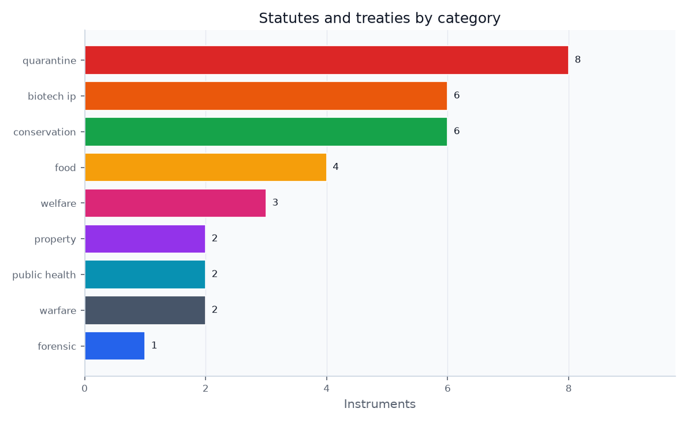

# The Insect as Threat: Quarantine, Invasion, and Vector Control {#sec:threat}

Where forensic law asks insects to *speak*, regulatory law tries to *stop them from moving*. The architecture is dense and federal. In the registry the threat role is statute-driven rather than case-driven: it is anchored by {{THREAT_STATUTE_COUNT}} instruments spanning the quarantine and public-health categories, summarized in the statutes-by-category figure.

{#fig:statutes_by_category width=85%}

## US quarantine authority and plant-pest movement

The master statute is the Plant Protection Act, cited here at {{PPA_CITATION}}, which empowers the U.S. Department of Agriculture's Animal and Plant Health Inspection Service (APHIS) to prohibit movement, declare quarantines, require permits, and seize or destroy infested articles [@ppa2000; @usc7_7712]. Moving a live insect interstate or importing one requires an APHIS permit and an approved containment facility. The rogues' gallery of regulated pests is encoded in the species registry: the spotted lanternfly under active quarantine [@aphis_slf], the Asian longhorned beetle under eradication, the emerald ash borer whose *federal* quarantine was lifted in 2021, and the northern giant hornet — the "murder hornet" — declared eradicated from the United States in 2024, the first *Vespa* eradication in North America [@guardian_hornet].

## International, IPPC, and EU risk layers

Above the US sits the International Plant Protection Convention, whose International Standards for Phytosanitary Measures (ISPMs) serve as the benchmark under the World Trade Organization (WTO) Agreement on the Application of Sanitary and Phytosanitary Measures (SPS Agreement) for judging whether a quarantine is science-based or a disguised trade barrier [@ippc_ispm]. IPPC's pest-status standard makes pest records, status categories, and uncertainty part of the legal infrastructure for deciding whether a pest is present in an area [@ippc_ispm8]. The European Union (EU) runs its own priority-pest list and plant-passport system under the Plant Health Law [@eu2016_2031]. The EU also treats invasive alien species as a separate Union-wide risk category: Regulation (EU) 1143/2014 creates a Union list whose species face restrictions on keeping, importing, selling, breeding, growing, and release, and the European Commission says the fourth update of that list entered into force on 7 August 2025 [@eu1143_2014; @ec_ias2026].

That architecture makes invasive-insect law a risk-allocation system, not merely a list of pests. The legal decision is whether uncertain ecological evidence justifies stopping trade, seizing property, requiring treatment, or spending public money on surveillance and eradication. Bioeconomic scholarship on invasive species frames that choice as an institutional problem of pathways, probabilities, expected harms, and management cost under uncertainty [@lodge2016bioeconomics_invasive_species]. Insects make the problem unusually sharp because the same shipment, nursery stock, package, or animal wound can be legally ordinary until an expert identifies a life stage, pathway, or reproductive risk that moves it into quarantine law.

## Liability gaps when pest movement is indirect

The Lacey Act's injurious-species provision at {{LACEY_CITATION}} is a strict-liability criminal statute, but it conspicuously **does not list insects**, deferring to the Plant Protection Act for plant pests and leaving non-plant-pest insects in a regulatory gap [@lacey42; @crs_lacey]. Recent enforcement marks the limits of secondary liability: in *Amazon Services LLC v. USDA* the D.C. Circuit held that aiding or inducing a regulated-pest movement requires conscious and culpable participation, not mere fulfilment services [@amazon2024]. And in a Minnesota tree-infestation suit the claim failed for lack of an entomological expert — proof that forensic and regulatory entomology converge, because invasive-pest causation cannot be shown without expert insect testimony [@minnlawyer_lac].

## Vectors as public-health infrastructure

The same regulatory logic extends to insects as disease vectors. California has operated mosquito-abatement and vector-control districts since 1915 under a statute declaring organized public programs the best protection against vector-borne disease [@ca_vector_hsc2001], and federal mosquito-control funding has been advanced as national public-health law [@asthovector]. International animal-health law adds a standards layer: WOAH's Terrestrial Code includes a chapter on surveillance for arthropod vectors of animal diseases, showing how vector law crosses animal health, human health, and trade [@woah_vector_surveillance]. This vector-control strand is where the threat role brushes against the weapon role of @sec:weapon.
