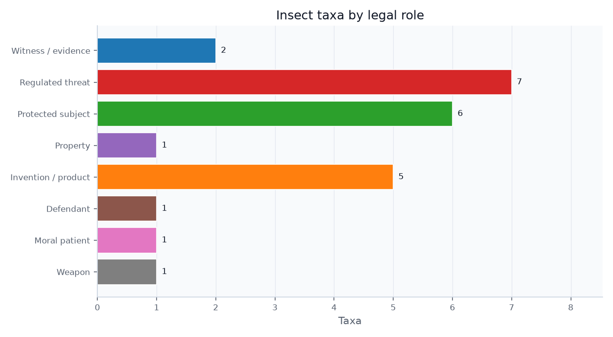

# The Insect as Protected Subject: Conservation and Recovery Law {#sec:protected}

The mirror image of quarantine law: instead of exterminating insects, the state guarantees their survival. The species registry encodes {{PROTECTED_SPECIES_COUNT}} taxa in the protected role — from the Schaus swallowtail, among the first insects ever listed, to the rusty patched bumble bee, the monarch, and the American burying beetle, summarized in the species-by-role figure.

{#fig:species_by_role width=85%}

## The ESA definition that reaches arthropods

The federal Endangered Species Act (ESA), cited here at {{ESA_CITATION}}, defines "fish or wildlife" to expressly include any "arthropod or other invertebrate," putting non-pest insects within the statute's eligibility frame [@esa1973; @usc16_1532]. Conservation-law scholarship has treated that textual inclusion as more than a curiosity: it is the doctrinal opening through which ecologically central but politically obscure organisms can become federal legal subjects [@lugo2006insect_conservation_esa]. Recent conservation science now reviews invertebrate listing history and threats as an ESA problem in its own right, reinforcing that insects are not merely edge cases inside vertebrate-centered conservation law [@shirey2025invertebrate_esa]. Among the first insects listed was the Schaus swallowtail in 1976 (with the Bahama swallowtail); the Delhi Sands flower-loving fly, listed in 1993, became the first and only fly — and the unlikely protagonist of a constitutional landmark.

## Commerce Clause protection for tiny species

In *National Association of Home Builders v. Babbitt*, cited at {{HOMEBUILDERS_CITATION}}, developers argued Congress lacked Commerce Clause power over a fly that lives entirely within California; a divided panel upheld the protection, and legal scholarship quickly recognized the Delhi Sands flower-loving fly as a test of whether tiny, local, economically inconvenient species could carry national ecological value [@homebuilders1997; @nagle1998delhi]. The "take" prohibition reaches habitat modification under *Babbitt v. Sweet Home*, so insect habitat enjoys the same protection as the insects themselves [@sweethome1995]. State law is widening the institutional map as well: Colorado's invertebrate conservation law adds rare plants and invertebrates to its nongame conservation statute and authorizes voluntary programs to conserve, protect, and perpetuate invertebrates [@co_hb24_1117].

## State law and the bumblebee-as-fish problem

California produced the field's most creative ruling. In *Almond Alliance of California v. Fish & Game Commission*, cited at {{ALMOND_CITATION}}, the Court of Appeal held that **bumblebees are "fish"** under {{CESA_FISH_CITATION}}, because that section's definition of "fish" includes "invertebrate" — allowing four *Bombus* species to be listed under the California ESA [@almond2022; @cesa_fgc45; @xerces_bumblebees]. It is the single most-cited "insect is a fish" holding in the field and links conservation law directly to the definitional question that recurs throughout (@sec:interconnections). The monarch butterfly was proposed for threatened listing in 2024; as of June 29, 2026, the U.S. Fish and Wildlife Service (FWS) still described the species as proposed and said protections would not apply until a final rule became effective [@fws2024monarch; @fws_monarch_status].

## Trade, pollinators, and insect decline

The Convention on International Trade in Endangered Species of Wild Fauna and Flora (CITES) supplies the trade-law counterpart: its official checklist identifies *Ornithoptera alexandrae* — Queen Alexandra's birdwing — as an insect with current listing I, and domestic implementing legislation then makes covered trade legal, sustainable, and traceable [@cites1973; @cites_checklist2026]. The global biodiversity layer broadens the frame: the Kunming-Montreal Global Biodiversity Framework gives insect conservation a treaty-scale target architecture, while insect-focused conservation scholarship warns that existing biodiversity indicators may fail to show whether policy is actually recovering insect populations unless insect-focused indicators are built [@cbd_gbf2022; @bladon2026gbf_insect_conservation]. EU conservation law is now more explicit about pollinators as a protected infrastructure: the Nature Restoration Regulation sits alongside the EU Pollinators Initiative, and the European Commission says that EU policy commits to reversing wild-pollinator decline by 2030 while reporting that 1 in 3 bee, butterfly, and hoverfly species is proven to be in decline and 1 in 10 bee and butterfly species is threatened with extinction [@eu_nature_restoration2024; @ec_pollinators2026]. Driving all of this is the science of the "insect apocalypse": a landmark study found a decline of more than 75 percent — a 76 percent seasonal and 82 percent mid-summer fall — in flying-insect biomass over 27 years of monitoring in protected areas [@hallmann2017], a finding amplified by global reviews and scientists' warnings about entomofauna decline and its interacting pressures [@sanchezbayo2019; @wagner2021insectdecline; @cardoso2020scientists_warning]. The legal-protection gap is now measurable as well as rhetorical: a 2026 PNAS study reports that the conservation status of 88.5 percent of described North American insect and arachnid species is unknown, while 94.7 percent of U.S. insects and arachnids at-risk throughout their range are not protected by any state or federal law [@esa_position2021; @pnas2026insects].

The legal difficulty is that insect value is often infrastructural rather than charismatic. Pollination, pest suppression, nutrient cycling, waste processing, and food-web support are ecological services before they are individualized legal interests, which means law must translate diffuse background work into administrable species, habitat, trade, and take decisions [@losey2006economic_value_insects]. That translation explains why this role touches both property and threat: the same insect can be valuable enough to protect in one setting and disruptive enough to suppress in another.
