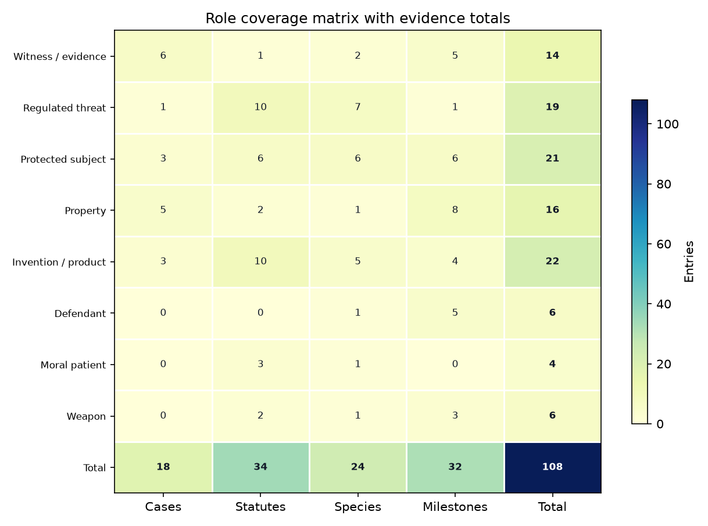

# Interconnections: How Insects Move Between Legal Roles {#sec:interconnections}

The {{ROLE_COUNT}} roles are not silos. They share recurring legal machinery, and the registry encodes {{INTERCONNECTION_COUNT}} themes that knit them together in the interconnections figure. The role-coverage matrix makes the field's structure visible at a glance: some roles are case-driven, some statute-driven, and some — the defendant and the weapon — almost entirely history-driven.

{#fig:role_interconnections width=85%}

{#fig:role_coverage width=80%}

The themes, and the roles each links, are catalogued below.

{{INTERCONNECTION_TABLE}}

- **The definitional problem** runs through everything: is a bumblebee a "fish" (@sec:protected), a screwworm a "plant pest" (@sec:threat), a fly "wildlife" (@sec:protected), an insect "made by man" and patentable (@sec:invention), or "sentient" (@sec:welfare)? Entomological law is, at root, a series of fights over what category a bug belongs to.
- **Expert testimony binds forensic and regulatory law**: proving invasive-pest causation requires the same entomological expertise as proving time of death (@sec:witness, @sec:threat).
- **Biotechnology is the pivot point**: engineered and gene-drive insects are simultaneously regulated products, conservation tools or threats, potential weapons, and moral patients (@sec:invention, @sec:protected, @sec:weapon, @sec:welfare).
- **Property and conservation are mirror images**: the honeybee one can own (@sec:property) and the bumblebee the state protects (@sec:protected) sit on opposite ends of the same *ferae naturae* doctrine, a line running from Hittite, rabbinic, Salic, and Lombard bee clauses through Justinian, Fleta, and Blackstone to modern listing law [@hittite_laws_bees; @mishnah_bava_batra5_3_beehive; @lex_salica_bees; @edictum_rothari_bees; @justinian533; @fleta1290_bees; @blackstone1766_bees].
- **The ancient and the cutting-edge rhyme**: Hittite hive theft, rabbinic bee nuisance, Roman bee pursuit, Irish bee trespass, Quintilian's poisoned-flower bee claim, and the 1587 weevil preserve all foreshadow modern fights over habitat, rights, and legally actionable insect status (@sec:defendant, @sec:protected, @sec:welfare) [@hittite_laws_bees; @mishnah_bava_batra2_10_bees; @justinian_digest41; @bechbretha1983; @quintilian_decl13_bees; @evans1906].

The connective tissue is not metaphorical. It is a recurring translation from biological fact to legal status. A larva becomes a clock; a mosquito becomes either public-health infrastructure or a releaseable regulated article; a fly becomes wildlife; a cricket becomes food, feed, and possibly a welfare subject. That is why the same evidentiary problem appears in unrelated doctrinal settings: law needs science to produce action-ready, reviewable claims without pretending uncertainty has disappeared [@jasanoff2015serviceable]. The Delhi Sands flower-loving fly made that problem constitutional, the EU Union list makes it administrative, the gene-drive debate makes it anticipatory, and the farmed-insect welfare debate makes it industrial [@nagle1998delhi; @ec_ias2026; @oye2014gene_drives; @barrett2023farmed_insect_welfare].

The deeper arc is status migration. Wild animals begin as unowned things, become qualified property when captured, become protected subjects when scarcity matters, become products when engineered or eaten, and become rights candidates when sentience or ecological standing enters the frame. The pre-modern sources show that this migration is not new: bees were already stolen swarms, hive contents, neighbor-law hazards, marked-tree resources, tithable yields, trespassers, and objects of neighborly remedy before modern conservation and biotech vocabularies existed, while colonial silk and wax instruments show insect-derived commodities becoming public economic policy before modern biotechnology law had a name [@hittite_laws_bees; @mishnah_bava_batra5_3_beehive; @mishnah_bava_batra2_10_bees; @lex_salica_bees; @edictum_rothari_bees; @selden1618_tithes_bees; @elderfield1650_tythes_bees; @virginia_assembly1619_mulberry; @carolina_charter1663_silks_wax]. Legal scholarship on living property and standing for natural objects helps explain why insects are such good stress tests: they sit at the edge of every familiar boundary while remaining biologically central to ecosystems, agriculture, evidence, and public health [@favre2010living_property; @stone1972trees; @cardoso2020scientists_warning; @fao2013edible_insects].

The hard cases also show why entomological law cannot be reduced to "nature law" or "animal law." A quarantine officer, a forensic expert, a conservation biologist, a food regulator, and a welfare theorist are often looking at the same biological fact but asking different institutional questions: admissibility, movement risk, extinction risk, market authorization, or moral considerability. Scholarship on invasive-species risk analysis, insect conservation, comparative food-and-feed regulation, and invertebrate ethics supplies the missing bridge: each field has built a translation apparatus for moving from uncertain insect science to a legal decision [@lodge2016bioeconomics_invasive_species; @lugo2006insect_conservation_esa; @lahteenmaki2021insectfoodfeed; @mikhalevich2020minds].

The newest sources sharpen that bridge. The Global Biodiversity Framework turns insect recovery into an indicator problem, because global targets cannot protect insects if monitoring systems do not detect insect-specific decline or recovery [@cbd_gbf2022; @bladon2026gbf_insect_conservation]. Utah's alternative-protein labeling statute shows the same classification work in market form: a cricket or mealworm ingredient must be named differently from conventional meat before consumer-protection law can act on it [@utah_hb138_2025]. In both settings, the legal question is not whether an insect exists; it is which institutional vocabulary makes the insect actionable.

The registry itself makes that classification work explicit. Each row asks what role the insect is playing, which institution is authorized to notice it, and what legal consequence follows from that notice. That mirrors scholarship on classification infrastructure and science/society co-production: the categories do not merely describe insects after law has acted; they help determine which facts can become legal facts in the first place [@bowker1999sorting; @jasanoff2004states_of_knowledge]. The insect becomes legally real when the right boundary is drawn around the right expertise, whether that boundary is a Daubert hearing, a quarantine perimeter, a listing rule, a patent claim, or a welfare threshold [@gieryn1983boundary_work].
