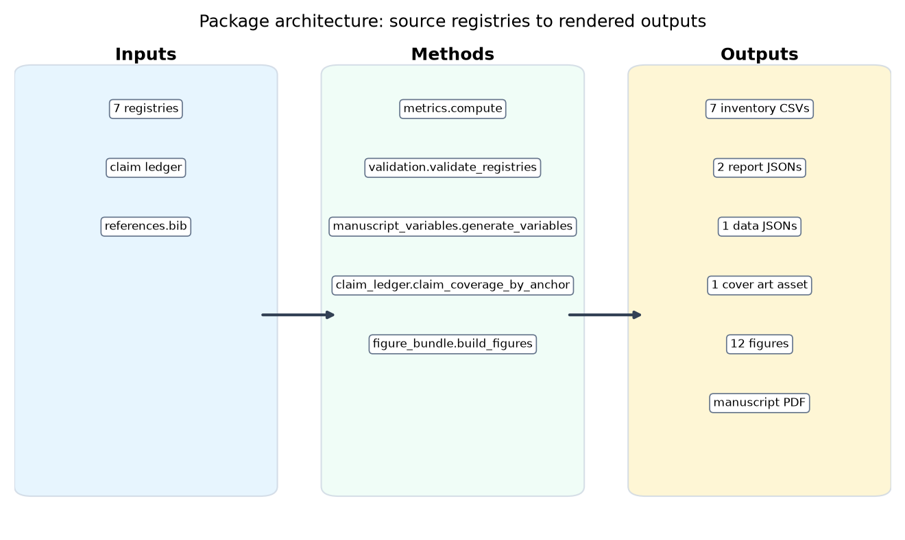
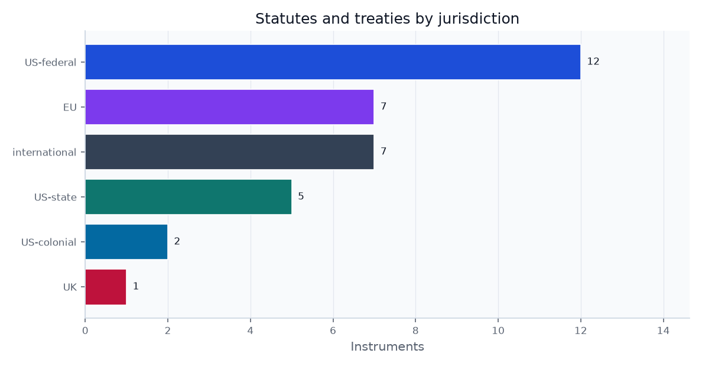
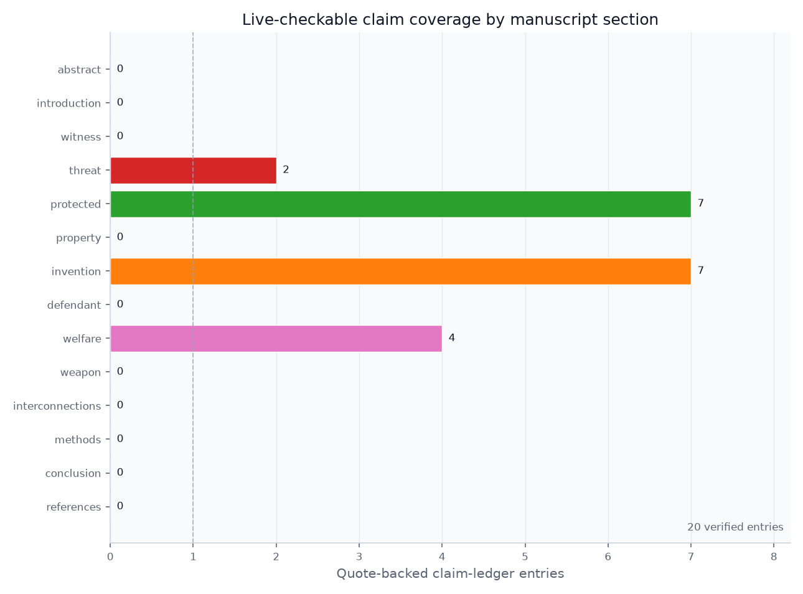

# Methods: Registry-First, Claim-Ledgered Legal Synthesis {#sec:methods}

This reference is built so that the map and the evidence cannot drift apart. All domain knowledge lives in {{REGISTRY_COUNT}} source-of-truth registries under `src/` — roles, cases, statutes, species, institutions, timeline, and interconnections — and every reader-facing artifact is regenerated from them, as shown in the architecture figure.

{#fig:architecture width=95%}

## Token closure: every count comes from code

Every magnitude-bearing number in this prose is a double-brace token (a `TOKEN` wrapped in doubled braces) resolved at build time by `src.manuscript_variables.generate_variables`. The closure test asserts that every token referenced in the manuscript is generated and that the generator emits no orphan, so a registry edit that changes a count (say, adding a case) updates the prose automatically, and a hand-typed count that drifts from its registry fails the build. The {{STATUTE_COUNT}} statutes span {{JURISDICTION_COUNT}} jurisdictions, shown in the statutes-by-jurisdiction figure; that number, like the {{CASE_COUNT}} cases and the {{FIGURE_COUNT}} figures, is generated, never typed.

{#fig:statutes_by_jurisdiction width=80%}

## Claim ledger: volatile facts need source quotes

Counts come from the registries; *external* and volatile current-status claims do not. Each externally-sourced statistic written as a numeral, and each date-sensitive status claim that the manuscript needs to preserve, is registered in `data/claim_ledger.yaml` with a verification record: the source URL, a verbatim supporting quote, an as-of date, a confidence label, and the date the check was last run. The current ledger contains {{CLAIM_LEDGER_COUNT}} quote-backed entries, with section coverage shown in the claim-ledger coverage figure. Two oracles bind these claims. The **offline** oracle (`src.claim_ledger.validate_claim_ledger`) proves each claim is attributed to a real bibliography key, anchored to a declared section, and carries a complete, fail-closed verification block — it cannot prove a number is *true*. The **live** oracle (`tests/test_live_claim_sources.py`, run with `-m live`) fetches each source URL and confirms the recorded quotes appear, so "verified" is a re-runnable fact rather than an assertion. This boundary is deliberate and documented: the green offline gate guarantees *shape and attribution*; only the live oracle guarantees *correspondence to the source*.

{#fig:claim_ledger_coverage width=80%}

## Validation gates for citations, cross-references, and statistics

A cross-registry validator fails closed on a malformed citation, an out-of-vocabulary role or category, a duplicate slug, or an empty required field, and writes its findings to `output/reports/validation.json`. A separate gate scans the manuscript for any numeral-form magnitude that is neither a generated token nor a value present in the claim ledger, with a negative control proving the detector fires on a planted statistic. Together these gates make the reference's central promise machine-checkable: no numeral-form statistic reaches the page unbacked.

The bibliography is also treated as data. The citation-date figure parses `references.bib` directly, so the reader can see where the source base is early legal text, where it is modern scholarship, and where it is official current-status material.

{#fig:citation_dates width=95%}

## Reproducibility metadata and render provenance

This build was generated on `{{PLATFORM}}` under Python `{{PYTHON_VERSION}}` from configuration hash `{{CONFIG_HASH}}` at `{{GENERATION_TIMESTAMP}}`. The same version-controlled inputs regenerate the inventories, the validation report, the figures, the manuscript variables, and this document with identical registry-derived content, modulo the provenance stamp.
