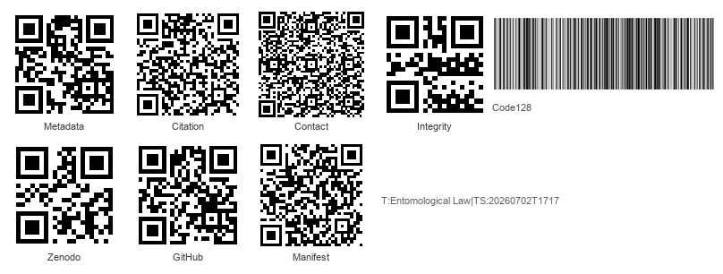
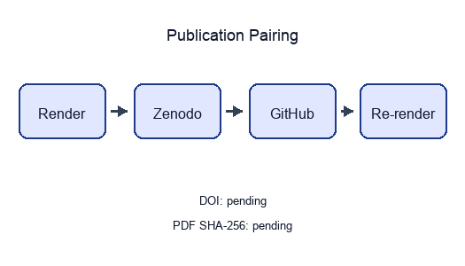

```{=latex}
\thispagestyle{empty}
\setlength{\parskip}{0pt}
\setlength{\itemsep}{0pt}
\begin{samepage}
\scriptsize
```

```{=latex}
\section*{BEGINNING OF TRANSMISSION}\label{beginning-of-transmission}
```

**State:** unpublished / pending pairing

**Pairing:** pending — unresolved:
- ✗ DOI minted: `pending`
- ✗ GitHub release URL: `pending`
- ✗ PDF SHA-256: `pending`

```{=latex}
\subsubsection*{Release metadata}
```

| Field | Value |
| --- | --- |
| Title | Entomological Law |
| Version | 1.0.0 |
| Concept DOI | pending |
| GitHub | docxology/EntoLaw |
| Zenodo | pending |
| SHA-256 | pending |
| SHA-512 | pending |

```{=latex}
\subsubsection*{How to verify}
```

- Scan **Integrity** QR and compare the embedded SHA-256 prefix to the table above.
- Scan **Zenodo** / **GitHub** QR codes and confirm they resolve to this release pairing.
- Full hashes and structured fields: `../data/transmission_manifest.json`.

{width=98%}

Structured manifest: `../data/transmission_manifest.json`

{width=35%}

```{=latex}
\end{samepage}
\newpage
```


<!-- BEGINNING OF TRANSMISSION -->